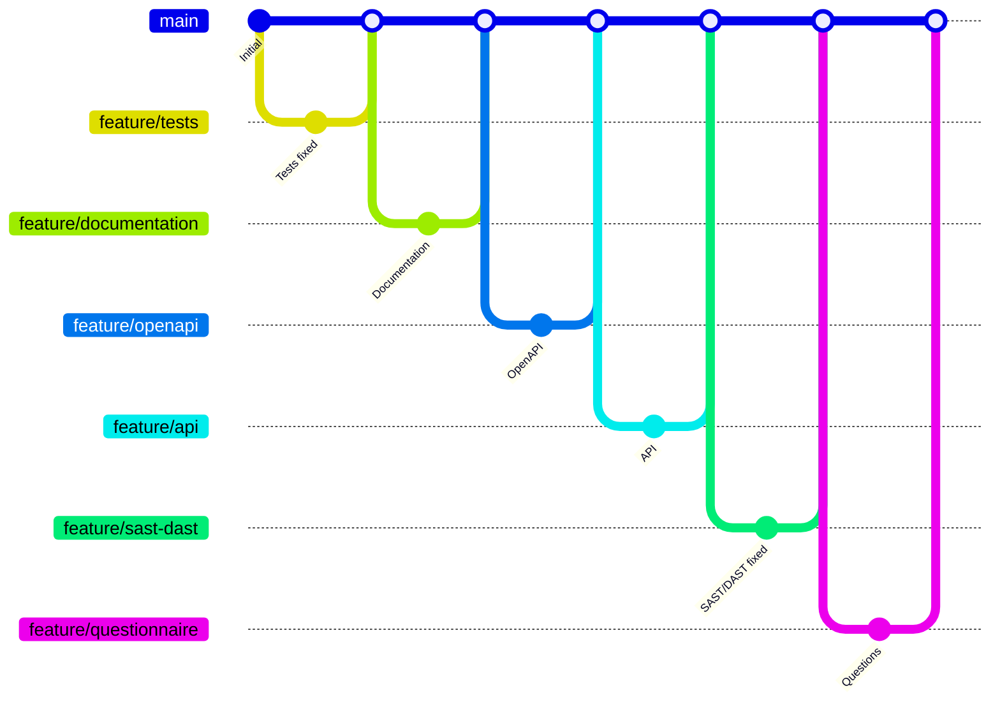

# Questionnaire — BC04EC10

> Projet : `my_distance` (calcul de distance entre deux points, Pythagore).
> Périmètre assumé : revue de code, tests et documentation. Je n'ai **pas**
> modifié `app.py` ; les corrections sont proposées et outillées (tests `xfail`),
> mais leur application au code est hors périmètre de cette épreuve.

## 1. Quelle était la dette technique en début de projet ? Comment l'avez-vous mesurée ?

Je l'ai mesurée avec trois outils statiques, qui sont aussi ceux qu'agrège un
SonarQube : **pylint** (note globale et code smells), **radon** (indice de
maintenabilité MI et complexité cyclomatique CC) et **bandit** (sécurité, SAST).

Mesures sur `my_distance/app.py` à l'état livré :

| Outil   | Métrique                         | Valeur initiale |
|---------|----------------------------------|-----------------|
| pylint  | note globale                     | **2,50 / 10**   |
| radon   | indice de maintenabilité (MI)    | 59,02 — note A (mais bas) |
| radon   | complexité cyclomatique moyenne  | 1,5 — note A    |
| bandit  | vulnérabilités détectées         | 0               |

La complexité est faible (le code est court), mais la densité de défauts est
élevée. Les *code smells* relevés : aucune validation des entrées, du code mort
(`print` après `return`, ligne 50), du code dupliqué (le dictionnaire de
résultat est construit deux fois dans `POST /`), des noms trompeurs
(`eNd`/`start`/`startPoint`/`EndPoint`, fonction `Calculate` en PascalCase),
des imports désordonnés, des `lambda` inutiles, aucune docstring et zéro test.
La dette est donc surtout une **dette de fiabilité** (entrées non validées) et
de **maintenabilité** (lisibilité), pas de complexité.

## 2. Quelle était la couverture en début de projet ? Comment l'avez-vous mesurée ?

**0 %.** Le projet livré ne contient aucun test ni aucune dépendance de test.
Mesure avec `coverage.py` via `pytest-cov` (`pytest --cov`) : aucune ligne
n'était exercée puisqu'il n'existait aucun test.

## 3. Quelle est la dette technique après vos modifications ? Qu'en dites-vous ?

Comme je n'ai volontairement pas touché à `app.py`, les **métriques intrinsèques
du code applicatif sont inchangées** (pylint 2,50/10, radon MI 59,02). En
revanche :

- la **dette de test** est quasi résorbée (couverture 0 % → ~100 %, voir Q4) ;
- la **dette documentaire** est résorbée (documentation développeur,
  description OpenAPI de l'API, ce questionnaire et le rapport) ;
- la dette restante est désormais **identifiée, tracée et exécutable** : chaque
  défaut est verrouillé par un test, et les comportements à corriger sont
  matérialisés par des tests `xfail` qui deviendront verts une fois le code
  corrigé.

Ce que j'en dis : la dette n'a pas disparu du code, mais elle est passée d'une
dette « invisible » à une dette « pilotée ». Les corrections recommandées
(validation des entrées, passage en `float`, suppression du code mort,
renommage, verbes HTTP propres) sont prêtes à être appliquées.

## 4. Quelle est la couverture en fin de projet après vos modifications ? Qu'en dites-vous ?

**~100 % des lignes et 97 % des branches** de `my_distance/app.py`, mesurées
avec `pytest --cov --cov-branch` :

```
Name                 Stmts   Miss Branch BrPart  Cover
my_distance/app.py      35      0      4      1    97%
```

La suite compte **21 tests** : 17 passants et 4 `xfail` (qui décrivent le
comportement attendu mais non implémenté). La branche partielle (`14->exit`)
correspond au retour implicite `None` lorsque la méthode HTTP n'est ni GET ni
POST.

Ce que j'en dis : une couverture de 100 % de lignes **ne signifie pas** que tout
est correct — une bonne partie de ces tests verrouille en réalité des
comportements fautifs (réponses 500). C'est pour cela que j'ai séparé les tests
en deux familles : ceux qui constatent le comportement réel et ceux, en `xfail`,
qui expriment l'attendu. La « couverture exhaustive » demandée est atteinte côté
lignes ; elle reste à compléter sur des cas métier (coordonnées négatives, très
grandes valeurs, décimales) dont j'ai déjà ajouté plusieurs représentants.

## 5. État des lieux : écart entre les attentes du contexte et l'état actuel

| Attente exprimée dans le contexte | État actuel | Écart |
|---|---|---|
| Application massivement utilisée | Stockage en liste globale en mémoire | Non scalable, non thread-safe, perdu au redémarrage |
| Extension prévue (formule de Haversine, échelle planète) | `int()` sur les coordonnées | Les décimales (lat/lon) sont impossibles : bloquant |
| Tests centrés sur l'interaction utilisateur | Aucun test livré | 0 % au départ |
| Couverture de test exhaustive | Aucune | À construire entièrement |
| API exploitable | API non conforme REST (cf. Q7) | Verbes/statuts/nommage à revoir |
| Saisie utilisateur robuste | Aucune validation | 500 dès qu'une saisie est invalide |

Sur l'organisation du développement : pas d'intégration continue, pas de linter
ni de formateur configuré, conventions de nommage non respectées, commentaires
quasi absents. L'écart entre l'ambition (produit massivement utilisé,
extensible, testé exhaustivement) et l'état livré (prototype non validé,
non testé) est important.

## 6. Schéma de la méthode de travail (branches)

J'ai travaillé avec **une branche de fonctionnalité par étape**, fusionnée
ensuite dans `main`. Le sujet exige que « tous vos commits doivent être présents
dans la branche principale de travail, à savoir main » : c'est le cas ici, car
je fusionne en **`--no-ff` (sans *squash*)** — chaque commit d'étape reste donc
**accessible depuis `main`**. La consigne impose la *présence* des commits sur
`main`, pas l'interdiction des branches ; le questionnaire prévoit d'ailleurs
explicitement ce cas (« en cas d'utilisation de branche de travail… »).

Pour chaque étape : une branche `feature/*` est créée depuis `main`, reçoit le
commit au message imposé, est validée (tests au vert), puis fusionnée en
`--no-ff` dans `main`.



Représentation ASCII :

```
feature/*:       ○      ○      ○      ○      ○      ○
                / \    / \    / \    / \    / \    / main: ●────────●───●──●───●──●───●──●───●──●───●──●───●
   Initial  Tests  Doc  OpenAPI API  SAST  Questions
           fixed                     /DAST
```

Tous les commits d'étape sont donc présents sur `main` (joignables depuis sa
pointe) tout en conservant une trace explicite du travail par branches.


## 7. L'API respecte-t-elle une architecture REST ?

**Non, partiellement seulement.**

Ce qui va dans le bon sens : l'API échange du JSON sur HTTP et nomme une
collection au pluriel (`/api/distances`).

Ce qui n'est pas conforme :

- **`/api/distance` est une action, pas une ressource** : un calcul n'est pas
  une entité REST. Il faudrait soit le modéliser comme création d'une ressource
  `distances` (`POST /api/distances` → 201), soit l'exposer en `GET` avec des
  paramètres de requête.
- **Mauvais usage des verbes** : la même route accepte `GET`, `POST` et `PUT`
  pour le même comportement. `GET /api/distance` lit pourtant `request.json` et
  renvoie systématiquement **415** : un GET doit être *safe* et sans corps.
- **Codes de statut inadaptés** : une entrée invalide renvoie **500** au lieu de
  **400** ; aucun **201**, aucun **405**.
- **Incohérence d'état** : `POST /` (formulaire) persiste le calcul, mais
  `POST /api/distance` non. Deux chemins, deux comportements.
- **`GET /api`** renvoie `{}` : pas de point d'entrée utile, pas de HATEOAS, pas
  de versionnement (`/v1`), pas de négociation de contenu.

Conclusion : c'est une API JSON sur HTTP, mais elle ne respecte pas l'interface
uniforme attendue d'une architecture REST.

## 8. Quel framework de tests a été utilisé par le développeur principal ?

**Aucun.** Le projet ne contient aucun test, aucune configuration de test et
aucune dépendance de test (ni `pytest`, ni `unittest`). La couverture initiale
est donc de 0 %. Pour la campagne de tests, j'ai introduit **pytest** (avec
`pytest-cov` pour la couverture).

## 9. Que pensez-vous des commentaires laissés par le développeur principal ?

Ils sont quasi inexistants et de faible valeur. `app.py` ne contient que **deux
commentaires** (3 % des lignes selon radon) : `# Si get, afficher la page vide`
et `# Si post, calculer et afficher le résultat`. Ils **paraphrasent le code**
(ils décrivent le « quoi » évident au lieu du « pourquoi »). Il n'y a **aucune
docstring** de module ou de fonction, ni typage. Enfin, le `print(...)` après le
`return` (ligne 50) est un **log oublié, jamais exécuté** : ni un vrai
commentaire, ni du code utile.

Recommandation : supprimer ces commentaires redondants, ajouter des docstrings
sur le module et chaque vue (rôle, entrées/sorties, codes d'erreur) et typer les
signatures.
